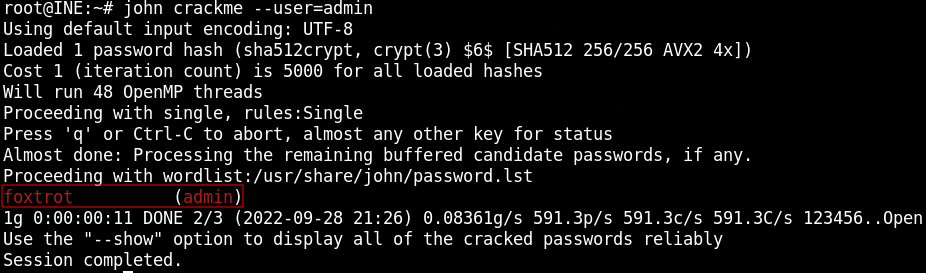
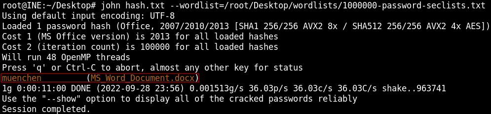
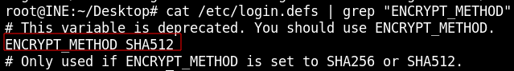
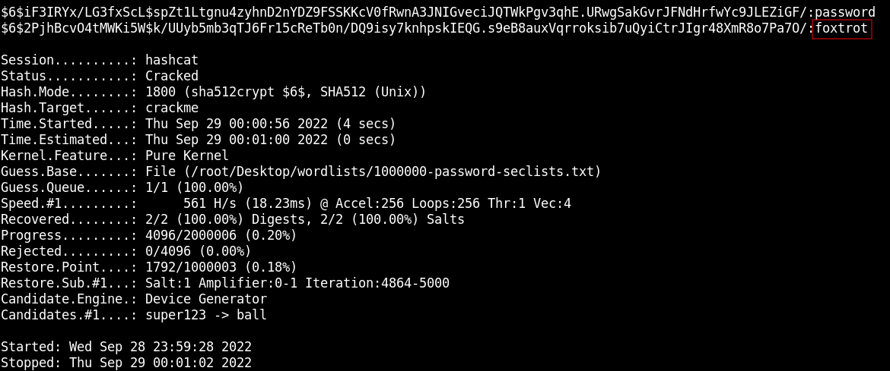
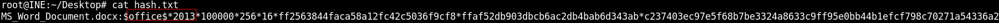
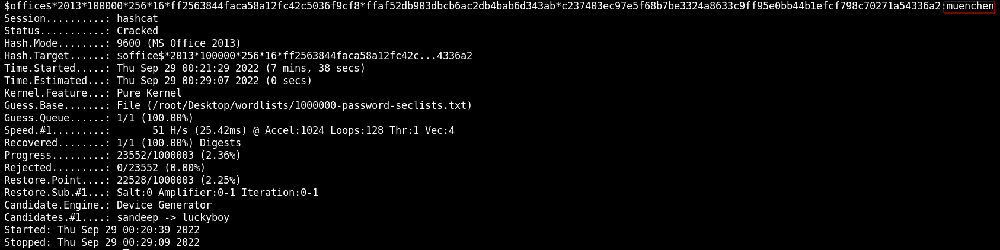

# Offline Brute Force & Password Cracking

## John the Ripper

### Crack Admin Password

```
unshadow /etc/passwd /etc/shadow > crackme
john crackme --user=admin
```



### Crack MS Word Password

```
python3 /usr/share/john/office2john.py MS_Word_Document.docx > hash.txt
john hash.txt --wordlist=/root/Desktop/wordlists/1000000-password-seclists.txt
```



## Hashcat

### Crack Admin Password

Check hash function used
```
cat /etc/login.defs | grep "ENCRYPT_METHOD"
```



-a ATTACK_MODE (0 = Straight)<br>
-m HASH_TYPE (1800 = sha512crypt $6$, SHA512 (Unix))<br>
--status shows status updates
```
unshadow /etc/passwd /etc/shadow > crackme
hashcat -a 0 -m 1800 --status crackme /root/Desktop/wordlists/1000000-password-seclists.txt
```



### Crack MS Word Password

Word 2013 Document



-m HASH_TYPE (9600 = MS Office 2013)
```
python3 /usr/share/john/office2john.py MS_Word_Document.docx > hash.txt
```

Modify hash file to use with hashcat<br>
Remove "MS_Word_Document.docx:"

```
hashcat -a 0 -m 9600 --status hash.txt /root/Desktop/wordlists/1000000-password-seclists.txt
```

